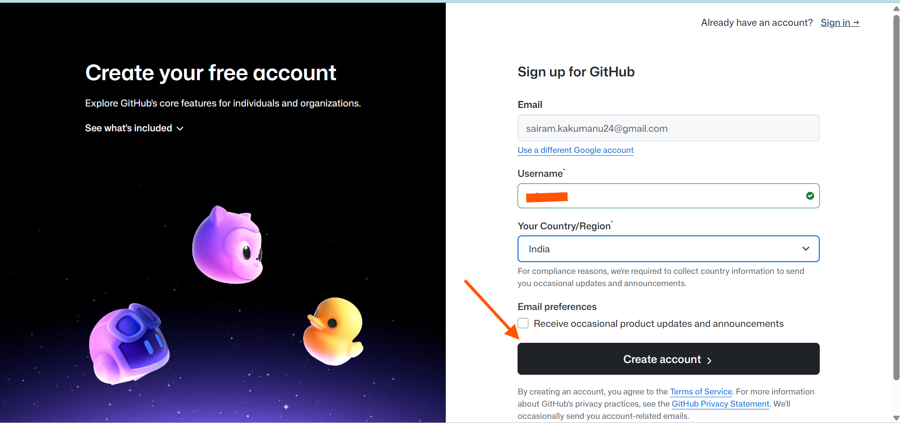
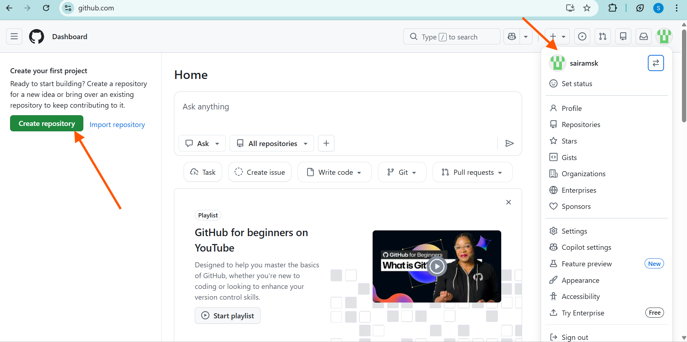
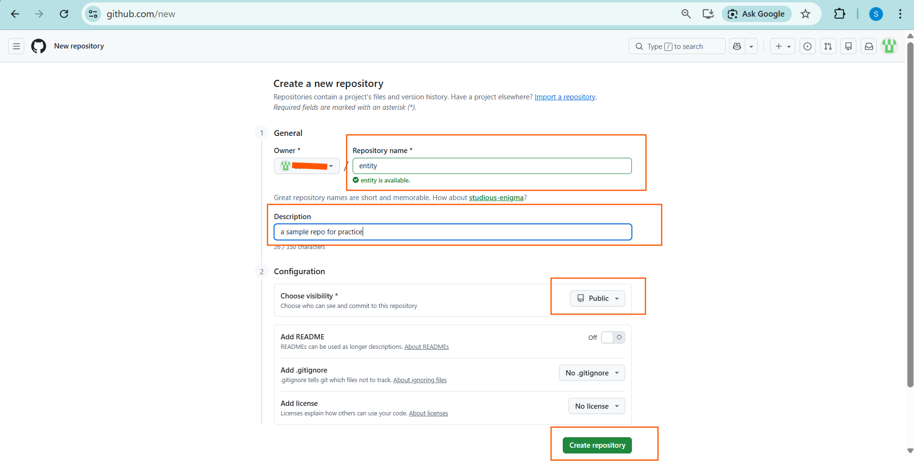
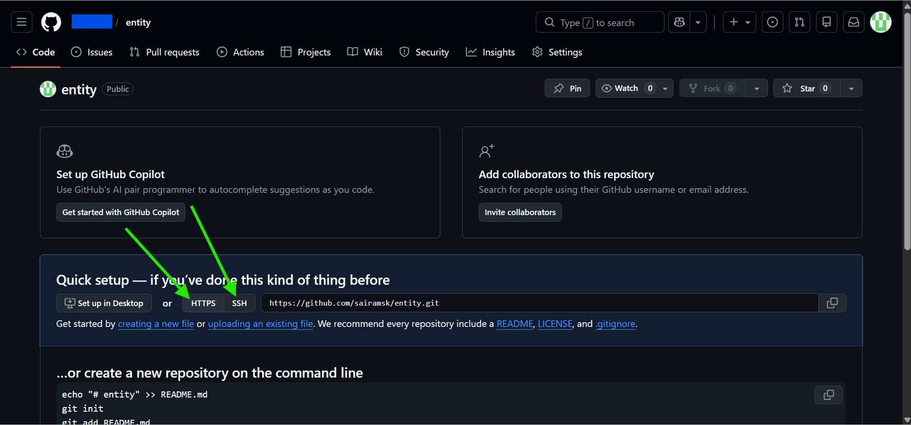
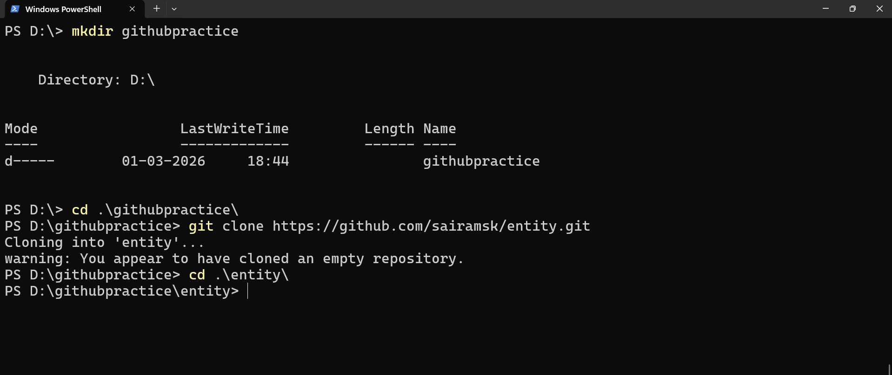
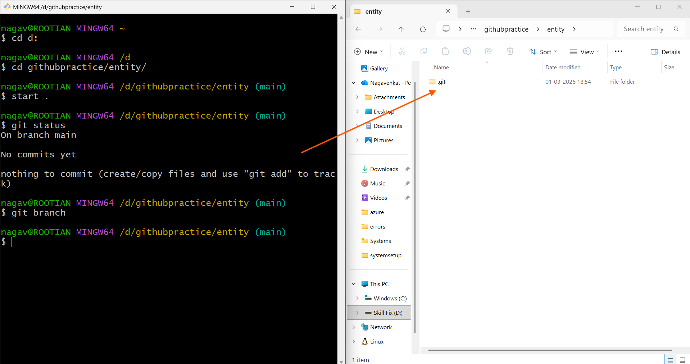
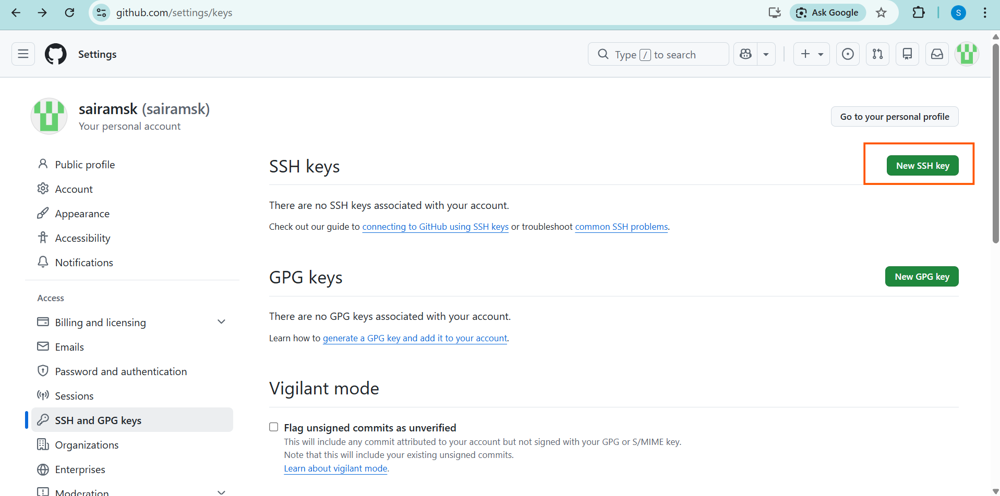
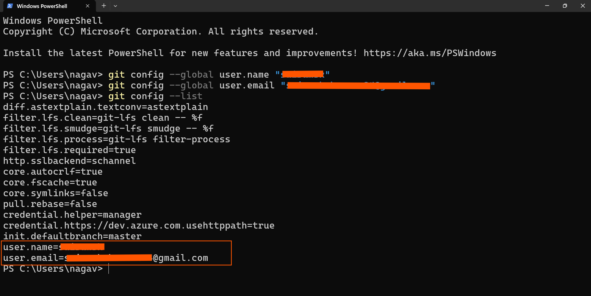

# How to create GitHub account

- [Refer Here](https://github.com/) to signup GitHub.


- To create GitHub account, signup with `email` and create `username` 



- After creating github account login page will be like 



***

# How to create a repository in GitHub (Remote Repository)

- Let's creat repository in Git and clone to local system/machine. 

- click on `Create repository` 




- When creating a remote repository on platforms like **GitHub, GitLab, or Bitbucket**, the repository page displays **two clone URLs**: HTTPS and SSH.

## HTTPS URL Format
```
https://github.com/username/repository.git
```
- Uses username/password or personal access token (PAT) for authentication.
- Prompts for credentials on each push/pull (unless cached).
- Works everywhere without SSH setup.

## SSH URL Format
```
git@github.com:username/repository.git
```
- Requires SSH key setup (public key added to your account).
- Passwordless authentication via your private key.
- Faster/more secure for frequent operations.





# How to Clone a Remote Git Repository to Local Using SSH URL?

### usecase 1: cloning remote repo to local using SSH URL

- open Terminal, Create one folder and `cd into the folder`

```bash
mkdir githubpractice
cd githubpractice
git clone <SSH URL>
```

- after cloning cd into the `repo` (as shown in the below image)

```bash
cd entity
```




- Here, If you want to open 
    - windows file explorer enter command `start .` 
    - VS Code enter command `code .`



***

- Now, in the repo try to 
    - `create some files` and 
    - `add` those files to files to staging area
    - `commit` all the changes


- **Now, To push all the local changes to the git remote repo, we need to do some additional configurations**
    - Configuring `SSH Keys for Git Authentication`
    - Configure GitHub `username` and `gmail` to your system


## How to Add an `SSH Key to GitHub`

- Open settings and click on `SSH and GPG Keys`


- Then, Click on `NEW SSH Key`




- [Refer Here](https://github.com/pnvenkatakrishna/sshkeys_setup/blob/main/sshkeyssetup.md) to understand **ssh keys generation**

- Here to add `public key`, open your `GitBash` and check as shown in the below image. 


- Add `public key` in the `key section` and give a `title`. 
    - click on `ADD SSH KEY`


- you will see Succesfully congigured ssh keys to GitHub.


## How to configure GitHub `username` and `gmail` to your system

- To configure your `Git username and email`, use the `git config` command in your terminal or PowerShell. This sets your identity for commits across repositories or per repo.


### Global Configuration
- Run these commands to set your username and email system-wide `(stored in ~/.gitconfig on Linux/Mac` or `%USERPROFILE%\.gitconfig on Windows)`. 


```bash
git config --global user.name "Your User Name"

git config --global user.email "your.email@example.com"
```



***

- Verify with 

```bash
git config --global --list or
git config --get user.name and 
git config --get user.email

```


***

- To check the connection between your system and GitHub account.

- Run the command 
```bash
ssh -T git@github.com  # as shown in the below image
```

## How to Push Changes from Local Git Repository to Remote Repository?


### Adding Remote Origin Before Pushing

**"origin"** is the conventional name for your primary remote repository.

1. **Copy remote URL** from GitHub/GitLab repo page (use SSH: `git@github.com:username/repo.git`).

2. **Add remote**:
   ```
   git remote add origin git@github.com:username/repo.git
   ```

3. **Verify**:
   ```
   git remote -v
   ```
   Shows: `origin git@github.com:username/repo.git (fetch/push)`

4. **Push** (sets upstream tracking):
   ```
   git push -u origin main
   ```


