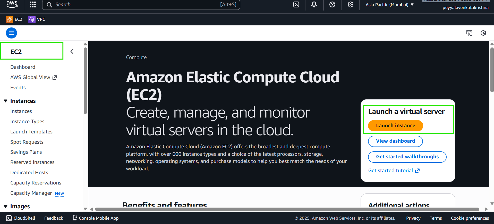
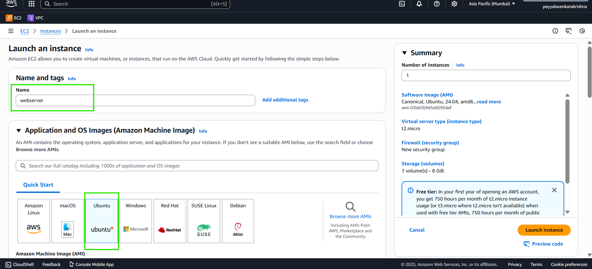
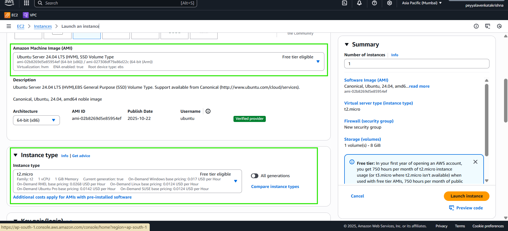
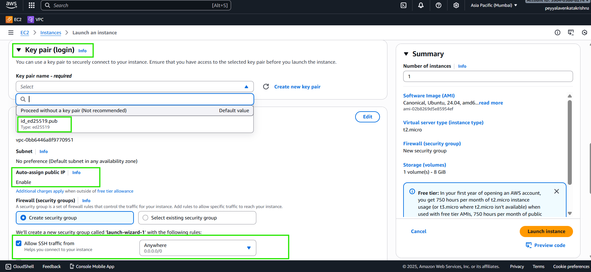
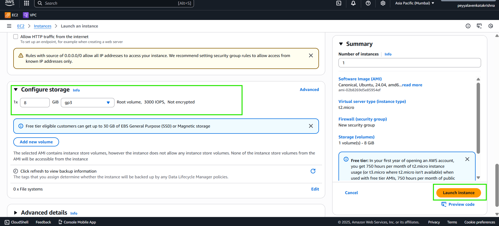
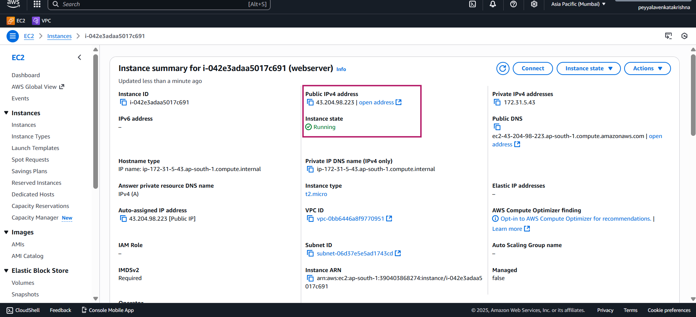
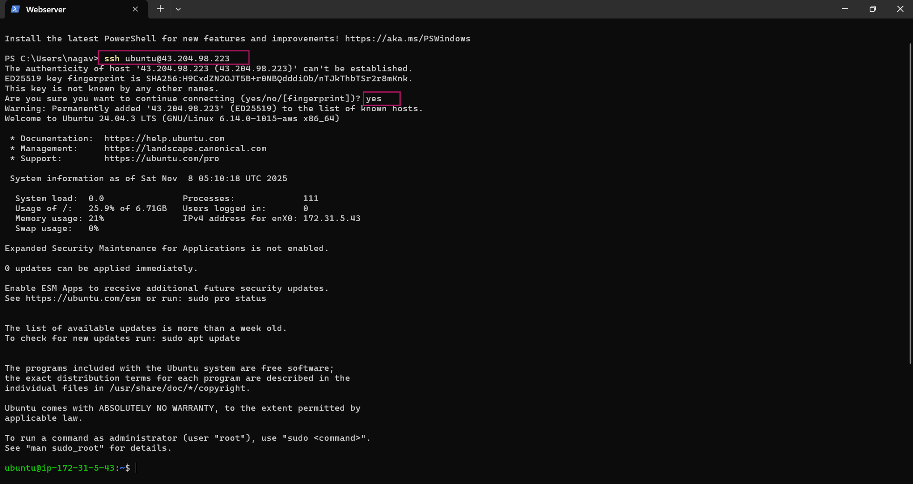

# How to Generate and Use SSH Keys on Windows for AWS and Azure VMs?

## How to Generate SSH Keys on a Windows Machine
#### To Generate SSH Key Pair in Windows

- Open the Terminal or PowerShell.

- Run the command:
  ```bash
  ssh-keygen
  ```
  - Press Enter to choose the default file location (e.g., `C:\Users\YourUserName\.ssh\id_ed25519`).


  - Optional: Add a passphrase or leave blank for no passphrase.
- Your public key will be found at `C:\Users\YourUserName\.ssh\id_ed25519.pub`.


### Why SSH keys are in the `.ssh` folder

- `.ssh` is the default folder where SSH looks for keys.
- It keeps `keys` organized and safe.

- Only you can access it, protecting your private key.
- AWS and Azure expect keys to be stored or used from here.
***
# Importing SSH Keys to AWS and Azure Cloud Accounts


# Import SSH Key to AWS Account (for EC2 launch)

- Open AWS Management Console,
  - **Go to EC2** 


- In EC2 section, 
  - under `Network and security` 
    - **Click on `Key pairs`** 


- Choose "Import Key Pair".


- Enter a key pair name.(Name = your choice)
- Open your public key file (e.g., `id_ed25519.pub`) as shown in the below image(click on browse to open).
- To save Click on Import Key Pair.


## Summary:

### Importing the Public Key to AWS
1. Log into AWS Management Console.
2. Go to EC2 Dashboard.
3. Under "Network & Security," click on **Key Pairs**.
4. Click **Import Key Pair**.
5. Provide a name for your key pair.
6. Open your public key file (`id_ed25519.pub`) in a text editor.
7. Copy the entire contents of the public key file.
8. Paste the copied key into the **Public key contents** field.
9. Click **Import** to save the key pair.
***
**NOTE:**
- When launching a new EC2 instance, select your imported key pair in the Key Pair section.
***
## How to Launch AWS Ubuntu Instance with Imported Key

1. Open AWS Management Console and go to EC2 Dashboard.

2. Click **Launch Instance**.



3. Select an Ubuntu Server AMI (e.g., Ubuntu 20.04 LTS or Ubuntu 24.04 ).



4. Choose the instance type (e.g., t2.micro for free tier).



5. Click **Next** to configure instance details as needed.

6. In the **Key Pair** section, select the imported SSH key pair from the dropdown.



7. Configure security group to allow SSH (port 22) access from your IP address.

8. Review and click **Launch** to start the instance.



9. Wait for the instance to enter the "running" state.
10. Note the public IP address of the instance for SSH access.



11. To connect to Instance, Open Terminal and run the command

``` bash
 ssh ubuntu@43.204.98.223
```

***
