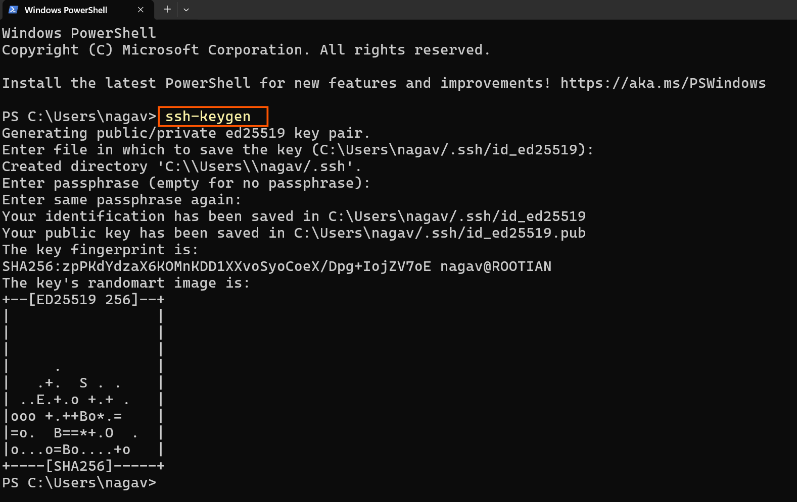
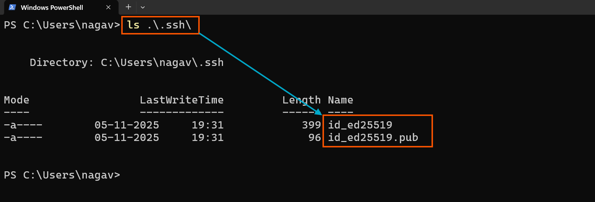
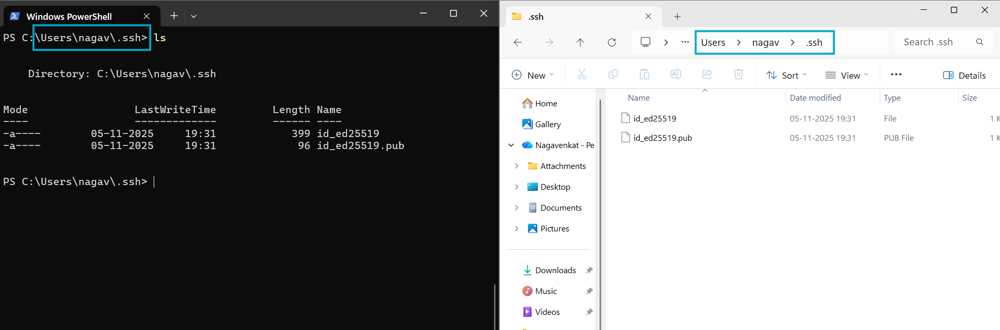
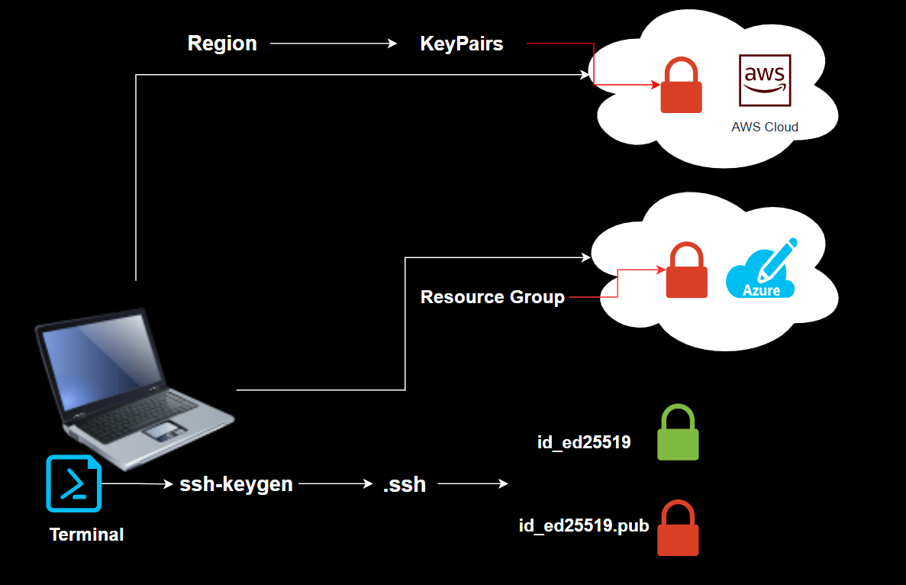
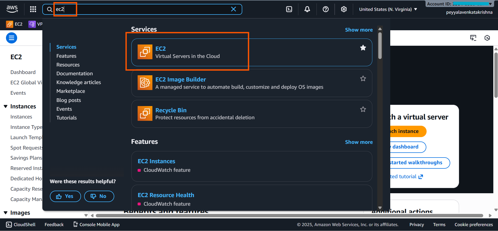
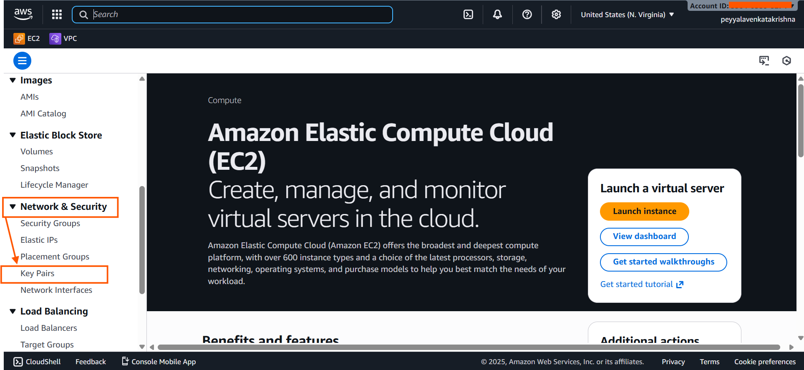
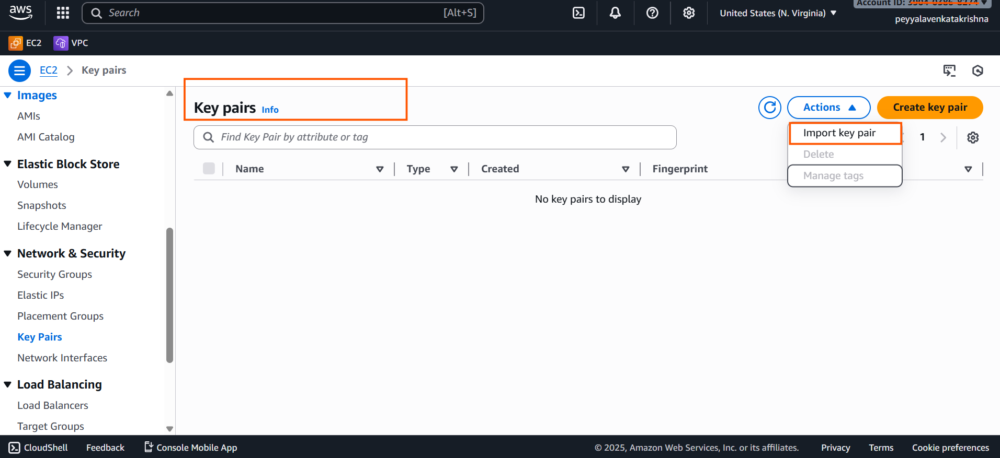
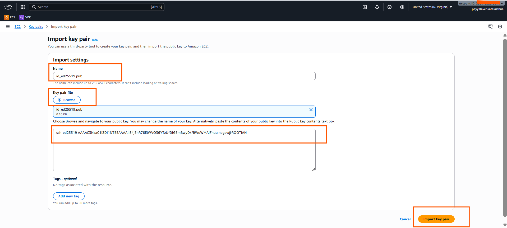

# How to Generate and Use SSH Keys on Windows for AWS and Azure VMs?

## How to Generate SSH Keys on a Windows Machine
#### To Generate SSH Key Pair in Windows

- Open the Terminal or PowerShell.

- Run the command:
  ```bash
  ssh-keygen
  ```
  - Press Enter to choose the default file location (e.g., `C:\Users\YourUserName\.ssh\id_ed25519`).



  - Optional: Add a passphrase or leave blank for no passphrase.
- Your public key will be found at `C:\Users\YourUserName\.ssh\id_ed25519.pub`.




### Why SSH keys are in the `.ssh` folder

- `.ssh` is the default folder where SSH looks for keys.
- It keeps `keys` organized and safe.

- Only you can access it, protecting your private key.
- AWS and Azure expect keys to be stored or used from here.
***
# Importing SSH Keys to AWS and Azure Cloud Accounts




# Import SSH Key to AWS Account (for EC2 launch)

- Open AWS Management Console,
  - **Go to EC2** 


- In EC2 section, 
  - under `Network and security` 
    - **Click on `Key pairs`** 


- Choose "Import Key Pair".


- Enter a key pair name.(Name = your choice)
- Open your public key file (e.g., `id_ed25519.pub`) as shown in the below image(click on browse to open).
- To save Click on Import Key Pair.



**NOTE:**
- When launching a new EC2 instance, select your imported key pair in the Key Pair section.

