# How to Generate and Use SSH Keys on Windows for AWS and Azure VMs?

## How to Generate SSH Keys on a Windows Machine
#### To Generate SSH Key Pair in Windows

- Open the Terminal or PowerShell.

- Run the command:
  ```bash
  ssh-keygen
  ```
  - Press Enter to choose the default file location (e.g., `C:\Users\YourUserName\.ssh\id_ed25519`).

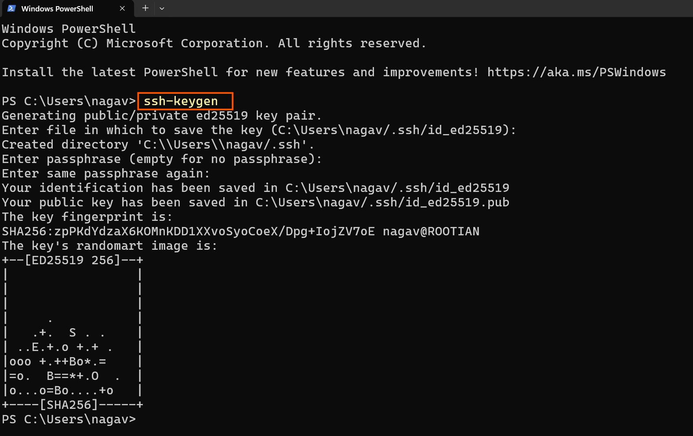

  - Optional: Add a passphrase or leave blank for no passphrase.
- Your public key will be found at `C:\Users\YourUserName\.ssh\id_ed25519.pub`.


### Why SSH keys are in the `.ssh` folder

- `.ssh` is the default folder where SSH looks for keys.
- It keeps `keys` organized and safe.


- Only you can access it, protecting your private key.


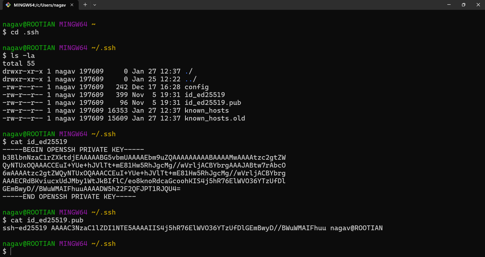

- AWS and Azure expect keys to be stored or used from here.
***


# Importing SSH Keys to AWS and Azure Cloud Accounts

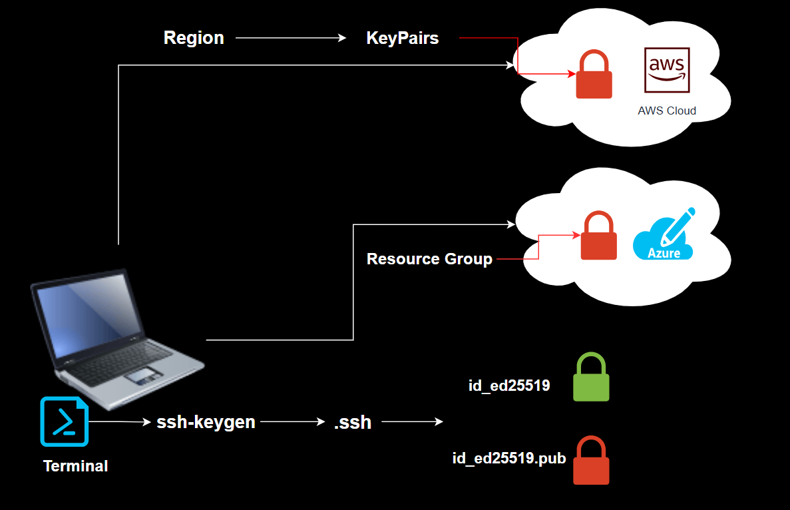


## AWS Free Plan Details

- AWS Free Tier for new accounts offers a Free Plan with up to $200 USD credits ($100 at signup + $100 earned via service exploration) valid for 6 months or until depleted. [aws.amazon](https://aws.amazon.com/free/)

- No charges during 6 months unless you upgrade to Paid Plan (one-click in console).

- Access to select popular services (e.g., EC2 t3.micro 750 hrs/mo, Lambda 1M requests, S3 5GB). [aws.amazon](https://aws.amazon.com/free/free-tier-faqs/)

- Always-free offers on 30+ services continue indefinitely after (monthly quotas reset). [aws.amazon](https://aws.amazon.com/free/free-tier-faqs/)

- Auto-closes after 6 months + 90-day grace if not upgraded; one per customer. [aws.amazon](https://aws.amazon.com/about-aws/whats-new/2025/07/aws-free-tier-credits-month-free-plan/)


## Signup & Login
1. aws.amazon.com/free → "Create Free Account" → New email, password, billing (₹2 India verification, refunded).

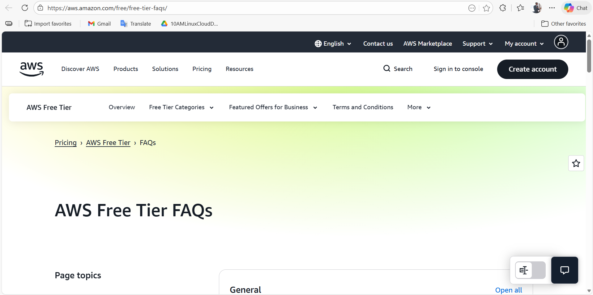

2. Verify email/phone → Select Free Plan/Basic Support → Activate. [aws.amazon](https://aws.amazon.com/free/free-tier-faqs/)


3. Login: console.aws.amazon.com → click on Root user → Signup email/password [aws.amazon](https://aws.amazon.com/free/)

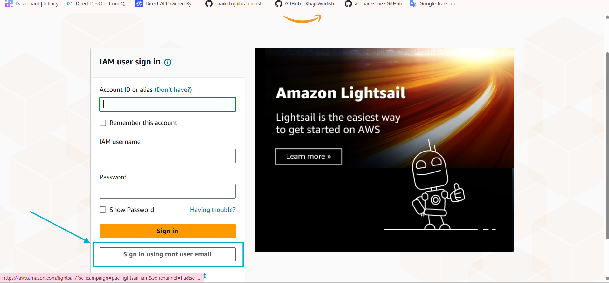

- Next 

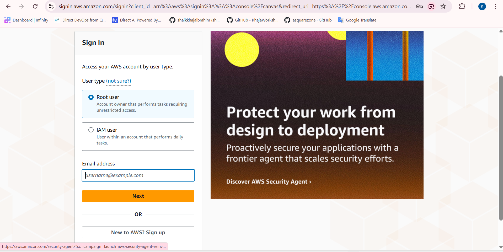

## Quick Tips

Track via Billing Console "Free Tier" page; set ₹500 alert. Ideal for your Python/DevOps practice on EC2/Lambda. [aws.amazon](https://aws.amazon.com/free/free-tier-faqs/)


# Import SSH Key to AWS Account (for EC2 launch)

- Open AWS Management Console,
  - **Go to EC2** 


- In EC2 section, 
  - under `Network and security` 
    - **Click on `Key pairs`** 

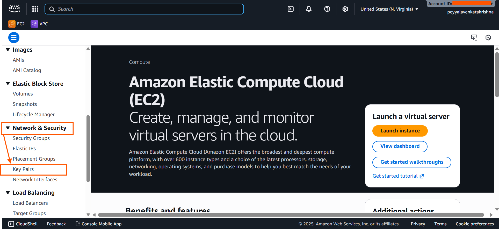
- Choose "Import Key Pair".

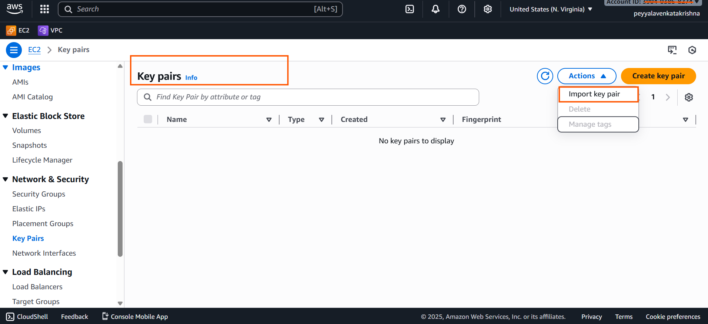
- Enter a key pair name.(Name = your choice)
- Open your public key file (e.g., `id_ed25519.pub`) as shown in the below image(click on browse to open).
- To save Click on Import Key Pair.

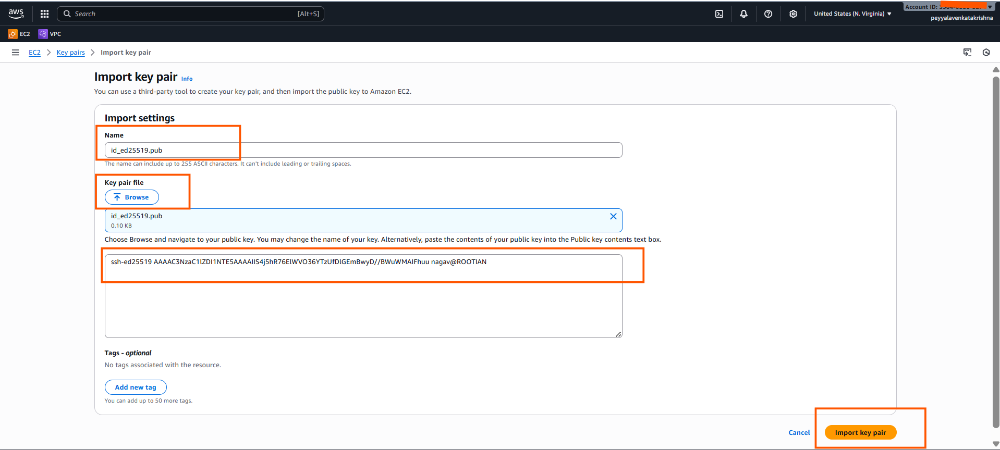


## Summary:

### Importing the Public Key to AWS
1. Log into AWS Management Console.
2. Go to EC2 Dashboard.
3. Under "Network & Security," click on **Key Pairs**.
4. Click **Import Key Pair**.
5. Provide a name for your key pair.
6. Open your public key file (`id_ed25519.pub`) in a text editor.
7. Copy the entire contents of the public key file.
8. Paste the copied key into the **Public key contents** field.
9. Click **Import** to save the key pair.
***

**NOTE:**
- When launching a new EC2 instance, select your imported key pair in the Key Pair section.
***


## How to Launch AWS Ubuntu Instance with Imported Key

1. Open AWS Management Console and go to EC2 Dashboard.

2. Click **Launch Instance**.

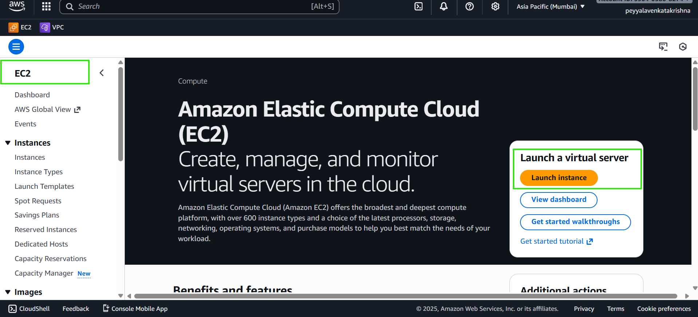

3. Select an Ubuntu Server AMI (e.g., Ubuntu 20.04 LTS or Ubuntu 24.04 ).


4. Choose the instance type (e.g., t2.micro for free tier).


5. Click **Next** to configure instance details as needed.

6. In the **Key Pair** section, select the imported SSH key pair from the dropdown.


7. Configure security group to allow SSH (port 22) access from your IP address.

8. Review and click **Launch** to start the instance.

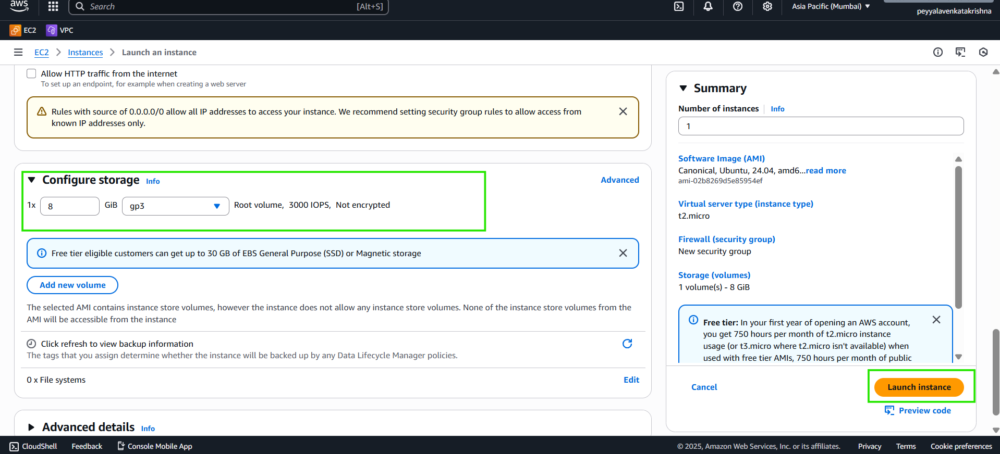

9. Wait for the instance to enter the "running" state.
10. Note the public IP address of the instance for SSH access.


11. To connect to Instance, Open Terminal and run the command

``` bash
 ssh ubuntu@43.204.98.223
```
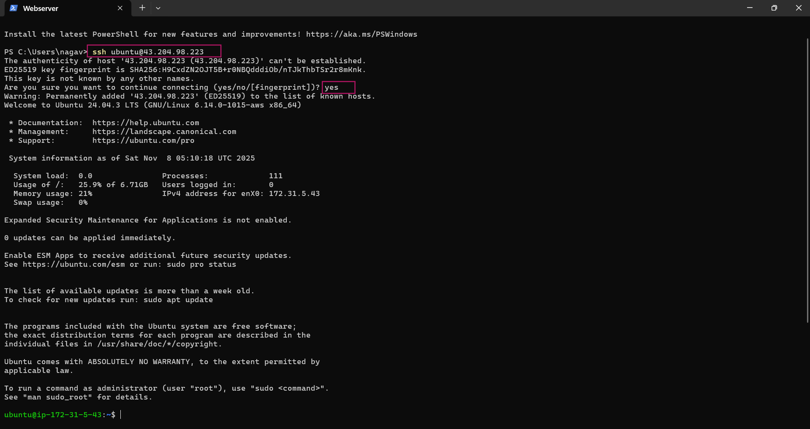
***


### Steps to Import SSH Public Key via Azure Portal

- To import an existing SSH public key into your Azure cloud account using the Azure Portal follow these steps.


1. **Sign In**
   - Log in to the [https://azure.microsoft.com](https://portal.azure.com) with your account credentials.

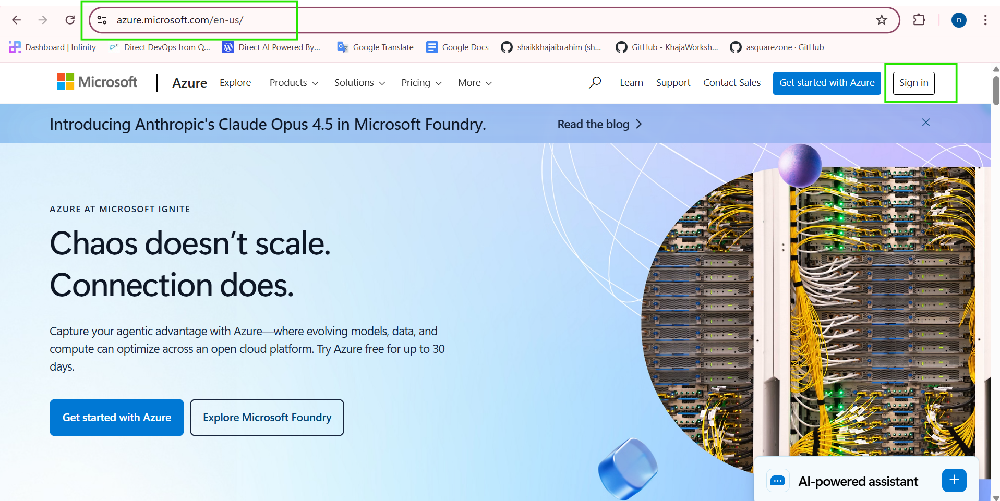

## Create Resource Group Using Azure Portal

1. In the left-hand menu, select **Resource groups** (or search "Resource groups" in the top search bar).

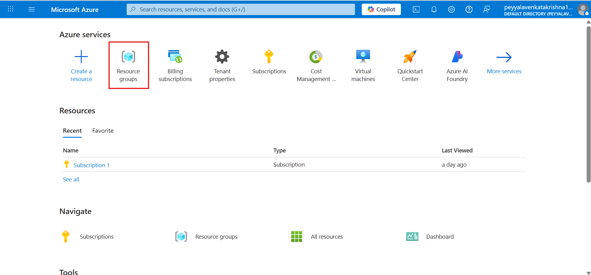

2. Click **+ Create** or **+ Add** at the top.


3. On the Create a resource group page:
   - **Subscription:** Select your Azure subscription.
   - **Resource group name:** Enter a unique name for the resource group.
   - **Region:** Select the Azure region where you want the resource group to reside.

4. Click **Review + create**.
5. After validation succeeds, click **Create**.


6. The resource group was created successfully and the details are displayed as follows:


2. **Navigate to SSH Key Management**
   - In the left menu or the search bar, type and select **SSH keys** or head to **Azure Home > SSH keys** (sometimes under "Security + Networking" or can be searched directly).

3. **Add SSH Key**
   - Click on **+ Add** or **Create** (may appear as “+ Add SSH key” or “+ Create SSH key”).

4. **Configure SSH Key Details**
   - **Region:** Select a region. Azure just stores the key metadata here; you can use the key in all regions.
   - **Key pair name:** Enter a meaningful, unique name for this key (for tracking and selection purposes).
   - **SSH public key source:** Choose “Upload existing public key” (not generate new).

5. **Paste the Public Key**
   - In the upload field, paste the entire contents of your existing SSH public key file (for example, contents of `id_rsa.pub` or `id_ed25519.pub`). Remove any extra whitespace.

6. **Review + Create**
   - Click **Review + create**. Azure runs validation on the input.

7. **Create and Finish**
   - Once validation passes, click **Create**. The SSH public key is now stored in your Azure account and available for assigning to virtual machines or other resources when needed.

***

### Additional Tips

- You can copy your public key again later by clicking on the key you uploaded and using the **Copy to clipboard** option.
- The uploaded public key can now be selected as an authentication method when creating or connecting to Linux VMs.
- At creation time for a VM, choose “Use existing key stored in Azure” to assign this imported public key.

***


